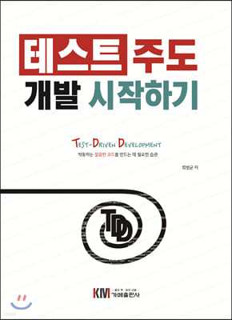

# 📚 테스트 주도 개발 시작하기 by 최범균

  

## 목차

- [Chapter 02. TDD 시작](notes/2-tdd-%EC%8B%9C%EC%9E%91.md)
- [Chapter 03. 테스트 코드 작성 순서](notes/3-%ED%85%8C%EC%8A%A4%ED%8A%B8-%EC%BD%94%EB%93%9C-%EC%9E%91%EC%84%B1-%EC%88%9C%EC%84%9C.md)
- [Chapter 04. TDD 기능명세 설계](notes/4-TDD-%EA%B8%B0%EB%8A%A5%EB%AA%85%EC%84%B8-%EC%84%A4%EA%B3%84.md)
- [Chapter 07. 대역](notes/7-%EB%8C%80%EC%97%AD.md)
- [Chapter 08. 테스트 가능한 설계](notes/8-테스트-가능한-설계.md)
- [Appendix C. Mockito](notes/C-mockito.md)
